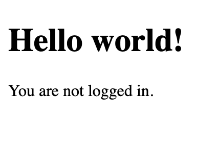
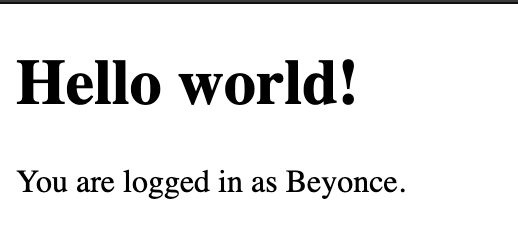
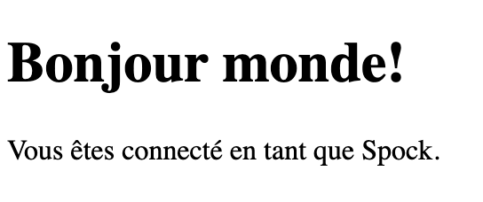
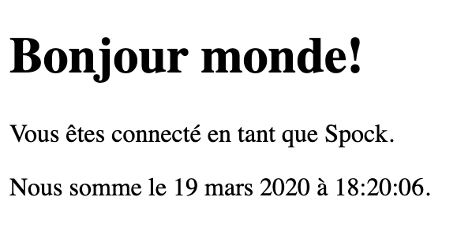
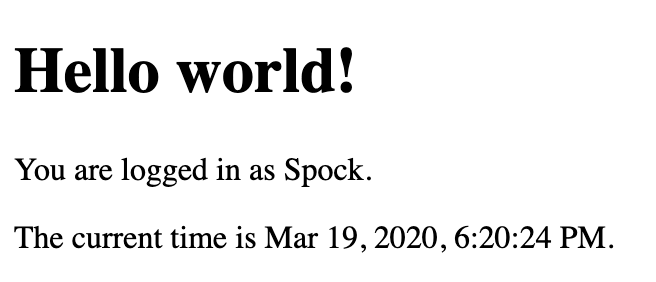

# 0x02. i18n
## Resources
- [Flask-Babel](https://web.archive.org/web/20201111174034/https://flask-babel.tkte.ch/)
- [Flask i18n tutorial](https://blog.miguelgrinberg.com/post/the-flask-mega-tutorial-part-xiii-i18n-and-l10n)
- [pytz](https://pypi.org/project/pytz/)

## Learning Objectives
Internationalization (i18n)
<details>
<summary>What is Internationalization (i18n)</summary>

### Internationalization (i18n)
Internationalization, often shortened to "i18n", is the practice of designing a system in such a way that it can easily be adapted for different target audiences, that may vary in region, language, or culture.

The complementary process of adapting a system for a specific target audience is called Localization.

Among other things, internationalization covers adapting to differences in:
- writing systems
- units of measure (currency, °C/°F, km/miles, etc.)
- time and date formats
- keyboard layouts

Internationalization typically involves:
1. Extracting hard-coded text strings from the code.
2. Using language-specific files for translated strings.
3. Providing a mechanism for switching languages dynamically.

</details>
<details>
<summary>How to parametrize Flask templates to display different languages</summary>

### Parametrize Flask templates to display different languages
To parameterize Flask templates for displaying different languages, you use Flask-Babel's ``_()`` function for translating text. This function marks strings for translation and is used within templates and Python code.

#### 1. Install Flask-Babel:
Ensure Flask-Babel is installed in your virtual environment:
``pip install Flask-Babel``

#### 2. Set Up ``Flask-Babel``:
Initialize ``Flask-Babel`` in your Flask app to handle translations.

**Example Setup (``app/__init__.py``):**
```python
from flask import Flask
from flask_babel import Babel

app = Flask(__name__)

# Configure Babel
app.config['BABEL_DEFAULT_LOCALE'] = 'en'
app.config['BABEL_DEFAULT_TIMEZONE'] = 'UTC'

babel = Babel(app)

@babel.localeselector
def get_locale():
    # Detect the language from the user's request or fallback to the default
    return request.args.get('lang') or 'en'
```
#### 3. Mark Text for Translation:
Use the ``_()`` function in Python and Jinja2 templates to mark text for translation.

**Python Example (``app/routes.py``):**
```python
from flask import render_template
from flask_babel import _

@app.route('/')
def index():
    greeting = _("Hello, welcome to our site!")
    return render_template('index.html', greeting=greeting)
```
**Jinja2 Template Example (``templates/index.html``):**
```html
<!DOCTYPE html>
<html lang="{{ get_locale() }}">
<head>
    <title>{{ _('Home Page') }}</title>
</head>
<body>
    <h1>{{ greeting }}</h1>
    <p>{{ _('This site is available in multiple languages.') }}</p>
</body>
</html>
```
#### 4. Extract Translatable Strings:
Extract marked text using the ``pybabel extract`` command. Create a ``babel.cfg`` file to specify file types and locations for extraction.

**Example ``babel.cfg``:**

```
[python: **.py]
[jinja2: templates/**.html]
```
**Run Extraction:**
```bash
pybabel extract -F babel.cfg -o messages.pot .
```
#### 5. Create Language Files:
Initialize translations for the desired languages using ``pybabel init``.

**Add a New Language:**
```bash
pybabel init -i messages.pot -d app/translations -l es  # for Spanish
pybabel init -i messages.pot -d app/translations -l fr  # for French
```
#### 6. Translate Text:
Edit the ``.po`` files in ``app/translations/<language>/LC_MESSAGES/`` and add translations.

**Example (``app/translations/es/LC_MESSAGES/messages.po``):**
```po
msgid "Hello, welcome to our site!"
msgstr "¡Hola, bienvenido a nuestro sitio!"

msgid "This site is available in multiple languages."
msgstr "Este sitio está disponible en varios idiomas."
```
#### 7. Compile Translations:
Compile the ``.po`` files into ``.mo`` files that Flask-Babel reads.
```bash
pybabel compile -d app/translations
```
#### 8. Add Language Switcher (Optional):
Create a way for users to change the language, such as with a dropdown or language links.

**Example (``templates/base.html``):**
```html
<nav>
    <a href="?lang=en">English</a> |
    <a href="?lang=es">Español</a> |
    <a href="?lang=fr">Français</a>
</nav>
```
#### 9. Set Locale Based on User Preference:
Update the ``@babel.localeselector`` function to detect the user's language choice from cookies, session data, or query parameters.

**Example Update:**
```python
@babel.localeselector
def get_locale():
    # Use a query parameter 'lang' to switch languages
    return request.args.get('lang') or 'en'
```
#### Summary:
1. Mark strings in templates and Python code with ``_()``.
2. Extract, translate, and compile translations.
3. Detect and set the locale based on user preferences.
4. Use ``{{ _('text') }}`` in templates to render translated strings.
</details>
<details>
<summary>Workflow After Adding New Translatable Text</summary>

### Workflow After Adding New Translatable Text
#### 1. Add or Modify Translatable Text:
Add ``_()`` in Python code or ``{{ _('text') }}`` in templates for new or updated content.

#### 2. Extract Translatable Strings:
Run ``pybabel extract`` to regenerate the ``messages.pot`` template file with the new or modified strings.
```bash
pybabel extract -F babel.cfg -o messages.pot .
```
#### 3. Update Language Files:
Run ``pybabel update`` to update the existing ``.po`` files with new or modified strings.
```bash
pybabel update -i messages.pot -d app/translations
```
This step updates the translation files for all languages and marks new or modified strings as ``fuzzy`` or untranslated.

#### 4. Translate New Strings:
Open each ``.po`` file in ``app/translations/<language>/LC_MESSAGES/`` and add translations for the new or updated strings.

#### 5. Compile Translations:
Compile the ``.po`` files into ``.mo`` files to make them usable by the Flask app.
```bash
pybabel compile -d app/translations
```
#### 6. Test the Application:
Run the application and check if the new translations display correctly.

</details>
<details>
<summary>Simplified Routine: streamline the process by using a script</summary>

### Create a Custom Flask Command
If you're frequently adding translatable content, you can streamline the process by using a script or custom Flask command to run these steps together.

1. **Create a New Command Module:** If you haven’t done so already, create a new module for your custom commands. You can place this in ``app/cli.py``.

2. **Define the Command:** Use Click to define a command that runs all the necessary steps.

Here's an example of how you could implement this in ``app/cli.py``:
```python
import os
import click
from app import app

@app.cli.command()
def update_translations():
    """Update translations by extracting, updating, and compiling."""
    # Step 1: Extract messages
    if os.system('pybabel extract -F babel.cfg -o messages.pot .'):
        raise RuntimeError('Extract command failed')
    
    # Step 2: Update translation files
    if os.system('pybabel update -i messages.pot -d app/translations'):
        raise RuntimeError('Update command failed')
    
    # Step 3: Compile translations
    if os.system('pybabel compile -d app/translations'):
        raise RuntimeError('Compile command failed')

    # Clean up the temporary file
    os.remove('messages.pot')
    click.echo('Translations updated successfully!')
```
#### Explanation of the Code:
- **Command Definition:** The ``@app.cli.command()`` decorator defines a new command called ``update_translations``.
- **Command Steps:**
    + **Extract:** Runs ``pybabel extract`` to create the ``messages.pot`` file.
    + **Update:** Runs ``pybabel update`` to update the language files.
    + **Compile:** Runs ``pybabel compile`` to compile the translations.
- **Error Handling:** Each command's success is checked, and if any command fails, a RuntimeError is raised.
- **Cleanup:** The temporary ``messages.pot`` file is removed after processing.
- **Feedback:** A message is printed to indicate successful completion.
#### How to Use the Command
**Example Workflow**
Here’s an example workflow for adding a new translated message:
##### 1. Add a new message in your Flask app:
```python
# Example in your app code
from flask_babel import _

def some_function():
    return _("Welcome to our website!")
```
##### 2. Extract the new message: Run the command:
```bash
flask update_translations
```
##### 3. Initialize a new language if necessary:
```bash
flask translate init fr  # For French, for example
```

##### 4. Edit the French ``.po`` file:
```po
#: path/to/your/file.py:line_number
msgid "Welcome to our website!"
msgstr "Bienvenue sur notre site Web!"
```
##### 5. Update and compile translations: Run the command:
```bash
flask update_translations
```
</details>
<details>
<summary>How to infer the correct locale based on URL parameters, user settings or request headers</summary>

### Infer the correct locale based on URL parameters, user settings or request headers
#### 1. Using URL Parameters
You can set up your Flask routes to accept a locale as a URL parameter.
```python
from flask import Flask, request, redirect, url_for
from flask_babel import Babel

app = Flask(__name__)
babel = Babel(app)

# Define available languages
LANGUAGES = ['en', 'fr', 'es']

@app.route('/<locale>')
def index(locale):
    # Redirect to the main index route if the locale is invalid
    if locale not in LANGUAGES:
        return redirect(url_for('index', locale='en'))
    return f"Current locale: {locale}"
```
#### 2. Using User Settings
If your application has user accounts, you can store the preferred language in the user profile and retrieve it during each request.
```python
from flask import session

@babel.localeselector
def get_locale():
    # Check if the user is logged in and has a preferred language
    if 'user_id' in session:
        user = get_user(session['user_id'])  # Fetch user from the database
        return user.preferred_language
    return 'en'  # Fallback to English
```
#### 3. Using Request Headers
You can also infer the locale based on the ``Accept-Language`` header sent by the client. This is often used in web applications to determine the user's preferred language.
```python
@babel.localeselector
def get_locale():
    # Check the Accept-Language header
    languages = request.accept_languages
    return languages.best_match(LANGUAGES) or 'en'
```
#### Combining All Three Methods
You can create a more comprehensive locale selection strategy by combining these methods:
```python
@babel.localeselector
def get_locale():
    # Check for locale in URL parameters
    locale = request.view_args.get('locale')
    if locale and locale in LANGUAGES:
        return locale
    
    # Check for user settings in session
    if 'user_id' in session:
        user = get_user(session['user_id'])  # Replace with your user fetching logic
        if user.preferred_language in LANGUAGES:
            return user.preferred_language
    
    # Fallback to Accept-Language header
    languages = request.accept_languages
    return languages.best_match(LANGUAGES) or 'en'
```
**Example of Using Babel**
```python
from flask import Flask, session, request
from flask_babel import Babel

app = Flask(__name__)
app.secret_key = 'your_secret_key'
babel = Babel(app)

# Define available languages
LANGUAGES = ['en', 'fr', 'es']

@babel.localeselector
def get_locale():
    locale = request.view_args.get('locale')
    if locale and locale in LANGUAGES:
        return locale
    
    if 'user_id' in session:
        user = get_user(session['user_id'])  # Your logic here
        if user.preferred_language in LANGUAGES:
            return user.preferred_language
    
    languages = request.accept_languages
    return languages.best_match(LANGUAGES) or 'en'

@app.route('/<locale>')
def index(locale):
    return f"Current locale: {locale}"

if __name__ == '__main__':
    app.run(debug=True)
```
</details>
<details>
<summary>How to localize timestamps</summary>

### Localizing timestamps
Localizing timestamps in a Flask application involves formatting dates and times according to the user's locale and timezone.
#### 1. Install Flask-Babel: 
```bash
pip install Flask-Babel
```
#### 2. Set Up Flask-Babel: 
Initialize ``Flask-Babel`` in your Flask app:
```python
from flask import Flask
from flask_babel import Babel

app = Flask(__name__)
babel = Babel(app)

# Configure your app and supported languages here
```
#### 3. Define a Locale Selector:
Use a locale selector to determine the user's preferred language:
```python
from flask import request

@babel.localeselector
def get_locale():
    # Logic to determine the user's locale (URL parameter, user settings, headers, etc.)
    return request.accept_languages.best_match(['en', 'fr', 'es'])
```
#### 4. Install pytz for Timezone Handling:
To handle time zones properly, you can use the pytz library.
```bash
pip install pytz
```
#### 5. Localize Timestamps:
Use `Flask-Babel` and ``pytz`` to localize timestamps in your application.

**Example Code**
```python
from flask import Flask, request
from flask_babel import Babel, format_datetime
from datetime import datetime
import pytz

app = Flask(__name__)
babel = Babel(app)

# Supported languages
LANGUAGES = ['en', 'fr', 'es']

@babel.localeselector
def get_locale():
    return request.accept_languages.best_match(LANGUAGES)

@app.route('/timestamp')
def timestamp():
    # Example timestamp in UTC
    utc_time = datetime.utcnow()
    
    # Get the user's timezone (you can implement a method to get this from user settings)
    user_timezone = pytz.timezone('Europe/Paris')  # Example timezone; replace with user's timezone
    
    # Localize the UTC time to the user's timezone
    localized_time = utc_time.replace(tzinfo=pytz.utc).astimezone(user_timezone)
    
    # Format the localized timestamp for the user's locale
    formatted_time = format_datetime(localized_time)
    
    return f"Localized Timestamp: {formatted_time}"

if __name__ == '__main__':
    app.run(debug=True)
```

#### Handling User Timezones
You will likely want to store user timezones in your user model or profile. When the user logs in, retrieve their timezone and use it to localize timestamps.
```python
# Assuming you have a user object with a timezone attribute
user_timezone = user.timezone  # This should be a string like 'America/New_York'
```
</details>

## Tasks
### 0. Basic Flask app
First you will setup a basic Flask app in ``0-app.py``. Create a single ``/`` route and an ``index.html`` template that simply outputs “Welcome to Holberton” as page title (``<title>``) and “Hello world” as header (``<h1>``).

File: ``0-app.py``, ``templates/0-index.html``
### 1. Basic Babel setup
Install the Babel Flask extension:
```bash
$ pip3 install flask_babel==2.0.0
```
Then instantiate the ``Babel`` object in your app. Store it in a module-level variable named ``babel``.
In order to configure available languages in our app, you will create a ``Config`` class that has a ``LANGUAGES`` class attribute equal to ``["en", "fr"]``.
Use ``Config`` to set Babel’s default locale (``"en"``) and timezone (``"UTC"``).
Use that class as config for your Flask app.

File: 1-app.py, templates/1-index.html
### 2. Get locale from request
Create a ``get_locale`` function with the ``babel.localeselector`` decorator. Use ``request.accept_languages`` to determine the best match with our supported languages.

File: ``2-app.py``, ``templates/2-index.html``
### 3. Parametrize templates
Use the ``_``or ``gettext`` function to parametrize your templates. Use the message IDs ``home_title`` and ``home_header``.
Create a ``babel.cfg`` file containing
```python
[python: **.py]
[jinja2: **/templates/**.html]
extensions=jinja2.ext.autoescape,jinja2.ext.with_
```
Then initialize your translations with
```bash
$ pybabel extract -F babel.cfg -o messages.pot .
```
and your two dictionaries with
```bash
$ pybabel init -i messages.pot -d translations -l en
$ pybabel init -i messages.pot -d translations -l fr
```
Then edit files ``translations/[en|fr]/LC_MESSAGES/messages.po`` to provide the correct value for each message ID for each language. Use the following translations:

| **msgid**        | **English**                 | **French**                   |
|------------------|-----------------------------|-------------------------------|
| ``home_title``   | ``"Welcome to Holberton"``  | ``"Bienvenue chez Holberton"``|
| ``home_header``  | ``"Hello world!"``          | ``"Bonjour monde!"``          |

Then compile your dictionaries with
```bash
$ pybabel compile -d translations
```
Reload the home page of your app and make sure that the correct messages show up.

File: ``3-app.py``, ``babel.cfg``, ``templates/3-index.html``, ``translations/en/LC_MESSAGES/messages.po``, ``translations/fr/LC_MESSAGES/messages.po``, ``translations/en/LC_MESSAGES/messages.mo``, ``translations/fr/LC_MESSAGES/messages.mo``
 
### 4. Force locale with URL parameter
In this task, you will implement a way to force a particular locale by passing the ``locale=fr`` parameter to your app’s URLs.
In your ``get_locale`` function, detect if the incoming request contains ``locale`` argument and ifs value is a supported locale, return it. If not or if the parameter is not present, resort to the previous default behavior.

Now you should be able to test different translations by visiting ``http://127.0.0.1:5000?locale=[fr|en]``.
**Visiting ``http://127.0.0.1:5000/?locale=fr`` should display this level 1 heading:** 


File: ``4-app.py``, ``templates/4-index.html``
### 5. Mock logging in
Creating a user login system is outside the scope of this project. To emulate a similar behavior, copy the following user table in ``5-app.py``.
```python
users = {
    1: {"name": "Balou", "locale": "fr", "timezone": "Europe/Paris"},
    2: {"name": "Beyonce", "locale": "en", "timezone": "US/Central"},
    3: {"name": "Spock", "locale": "kg", "timezone": "Vulcan"},
    4: {"name": "Teletubby", "locale": None, "timezone": "Europe/London"},
}
```
This will mock a database user table. Logging in will be mocked by passing ``login_as`` URL parameter containing the user ID to log in as.

Define a ``get_user`` function that returns a user dictionary or ``None`` if the ID cannot be found or if ``login_as`` was not passed.

Define a ``before_request`` function and use the ``app.before_request`` decorator to make it be executed before all other functions. ``before_request`` should use ``get_user`` to find a user if any, and set it as a global on ``flask.g.user``.

In your HTML template, if a user is logged in, in a paragraph tag, display a welcome message otherwise display a default message as shown in the table below.

| **msgid**         | **English**                                  | **French**                                      |
|-------------------|----------------------------------------------|-------------------------------------------------|
| ``logged_in_as``  | ``"You are logged in as %(username)s."``     | ``"Vous êtes connecté en tant que %(username)s."`` |
| ``not_logged_in`` | ``"You are not logged in."``                 | ``"Vous n'êtes pas connecté."``                |

Visiting ``http://127.0.0.1:5000/`` in your browser should display this:



Visiting ``http://127.0.0.1:5000/?login_as=2`` in your browser should display this: 


File: ``5-app.py``, ``templates/5-index.html``
### 6. Use user locale
Change your ``get_locale`` function to use a user’s preferred local if it is supported.
The order of priority should be
1. Locale from URL parameters
2. Locale from user settings
3. Locale from request header
4. Default locale
Test by logging in as different users


File: ``6-app.py``, ``templates/6-index.html``
### 7. Infer appropriate time zone
Define a ``get_timezone`` function and use the ``babel.timezoneselector`` decorator.
The logic should be the same as ``get_locale``:
1. Find ``timezone`` parameter in URL parameters
2. Find time zone from user settings
3. Default to UTC
Before returning a URL-provided or user time zone, you must validate that it is a valid time zone. To that, use ``pytz.timezone`` and catch the ``pytz.exceptions.UnknownTimeZoneError`` exception.

File: ``7-app.py``, ``templates/7-index.html``
### 8. Display the current time
Based on the inferred time zone, display the current time on the home page in the default format. For example:
``Jan 21, 2020, 5:55:39 AM`` or ``21 janv. 2020 à 05:56:28``

Use the following translations
| **msgid**            | **English**                                     | **French**                             |
|----------------------|-------------------------------------------------|----------------------------------------|
| ``current_time_is``  | ``"The current time is %(current_time)s."``     | ``"Nous sommes le %(current_time)s."`` |

Displaying the time in French looks like this:



Displaying the time in English looks like this:


File: ``app.py``, ``templates/index.html``, ``translations/en/LC_MESSAGES/messages.po``, ``translations/fr/LC_MESSAGES/messages.po``